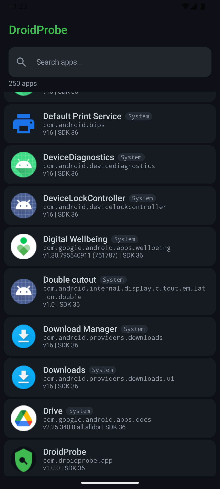
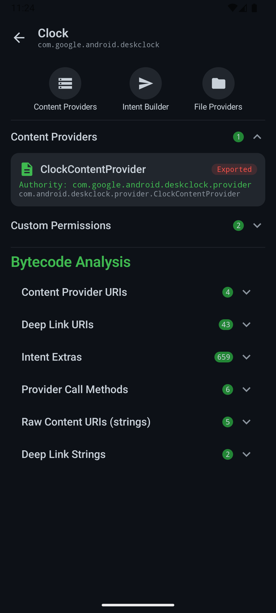
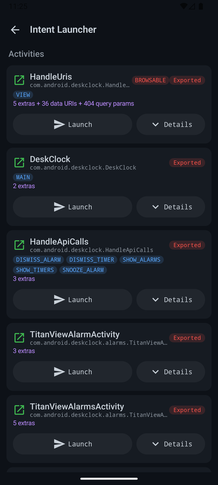
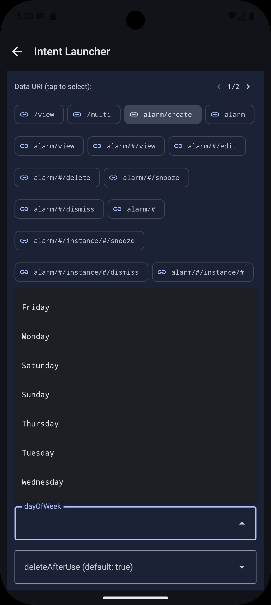

# DroidProbe

Android security tool that scans installed apps bytecode to discover content providers, file providers, and intent interfaces, then generates a contextual GUI for interacting with them — no root required.

Unlike tools like Drozer that require typing raw URIs and intent parameters, DroidProbe automatically discovers IPC surfaces from DEX bytecode and presents them as tappable, interactive UI elements.

## Install & Testing group
The test release of DroidProbe is published after joining <https://groups.google.com/g/droidprobe> it can be installed at <https://play.google.com/store/apps/details?id=com.droidprobe.app> please provide feedback :)

## Features

- **App Scanner** — Lists all installed apps (including system apps) with search filtering
- **Manifest Analysis** — Extracts exported activities, services, receivers, and providers with permissions and intent filters
- **Binary Manifest Parsing** — Parses binary AndroidManifest.xml (AXML) directly from APK files for complete intent filter extraction, including deep link schemes, authorities, paths, and MIME types that `PackageManager` query methods miss
- **DEX Bytecode Analysis** — Parses APK DEX files using dexlib2 with CFG-based register tracking to discover:
  - Content provider URIs (`UriMatcher.addURI`, `Uri.parse`, `CONTENT_URI` fields) with UriMatcher dispatch detection (match code → switch/if scoping)
  - Deep link URI patterns with query parameters (`Uri.getQueryParameter`, `getBooleanQueryParameter`) using 3-layer scoping: match-code → constructor-associated → class-level
  - Inter-procedural parameter detection via wrapper method summaries (pre-scan pass identifies methods that internally call `getQueryParameter` with a parameter-sourced key)
  - Intent extras with types (`getStringExtra`, `putExtra`, `Bundle.get*`)
  - ContentProvider `call()` method names and authorities
  - FileProvider path configurations from binary XML resources and `getUriForFile()` bytecode extraction (resolves actual filenames from `File` constructor arguments)
  - Raw `content://` and deep link string constants, all URL strings, and sensitive strings (API keys, tokens, credentials)
- **Security Warning Detection** — DEX-level pattern analysis flags potential vulnerabilities: WebView JavaScript/file access enabled, intent redirection (`getParcelableExtra` → `startActivity`), path traversal via `Uri.getLastPathSegment()`, unprotected exported components, and broad FileProvider path configurations
- **API Spec Explorer** — Fetches and parses API specification documents from discovered endpoints, supporting Google Discovery REST (`/$discovery/rest`), OpenAPI 3.x, and Swagger 2.0 formats. Auto-detects format, presents a browsable resource/method tree, and allows executing API calls directly with extracted keys and tokens. CFG-based forward taint analysis tracks where each extracted credential flows through bytecode to HTTP sinks (e.g., `addHeader` value arguments), associating keys only with endpoints they actually reach via inter-procedural dataflow
- **Content Provider Explorer** — Discovered URIs shown as tappable cards with "Query All" batch querying; per-URI inline results showing row/column counts; tap to expand full result table
- **Intent Launcher** — Exported components grouped by type with one-tap launch; expandable extras editor with type-appropriate keyboards, deep link URI selector with query parameter fields, pre-filled from bytecode analysis; BROWSABLE badge highlights browser-launchable attack surfaces; copy/share deep links for all browsable intents (custom scheme URIs or `intent://` format); ordered broadcast result capture showing resultCode, resultData, and resultExtras
- **FileProvider Browser** — Discovered paths as tappable cards with "Probe All" batch probing; cross-references XML path roots with code-discovered filenames to build probeable URIs; inline probe results showing accessibility, size, MIME type, and content preview
- **Class Hierarchy Resolution** — Extras are mapped to components via actual inheritance chain tracing, not name guessing

## Screenshots

<p align="center">
  
  
  
  
</p>

## How It Works

1. **Manifest pass** — Reads exported components, permissions, and provider authorities via `PackageManager`, then enriches intent filters by parsing binary AndroidManifest.xml (AXML) from the APK for complete action/category/data coverage
2. **DEX pass 1** — Builds a class hierarchy map (`class -> superclass`) from all DEX classes
3. **DEX pass 1.5** — Pre-scans for wrapper methods that internally call `getQueryParameter`/`getBooleanQueryParameter` with a parameter-sourced key, storing argument positions for call-site resolution in pass 2
4. **DEX pass 2** — Scans bytecode with six extractors using CFG-based forward register tracking: `UriPatternExtractor` (with UriMatcher dispatch detection), `IntentExtraExtractor`, `FileProviderExtractor` (XML + `getUriForFile` bytecode), `ContentProviderCallExtractor`, `StringConstantCollector`
5. **Inheritance resolution** — Maps discovered extras to exported components by walking the inheritance chain (handles inner classes, base classes, and superclass propagation)
6. **Security analysis** — Cross-references DEX-detected patterns (WebView misconfig, intent redirection, path traversal) with exported component set to generate actionable security warnings
7. **Interactive GUI** — Pre-populates interaction screens from analysis results, including API spec exploration for discovered endpoints

## Tech Stack

| Component | Version |
|---|---|
| Kotlin | 2.2.10 |
| Jetpack Compose (BOM) | 2026.02.00 |
| Material 3 | Latest via BOM |
| Android Gradle Plugin | 9.0.1 |
| Room | 2.8.4 |
| Navigation Compose | 2.9.7 |
| smali-dexlib2 | 3.0.9 |
| Min SDK | 31 |
| Target SDK | 36 |

## Architecture

- **Single-activity** with Navigation Compose and type-safe `@Serializable` routes
- **MVVM** with ViewModels + StateFlow
- **Manual DI** via `AppModule` service locator (no Hilt/Dagger)
- **In-memory cache** (`ConcurrentHashMap`) in `AnalysisRepository` for sharing DEX results across screens
- **Gzip-compressed persistence** — Analysis results stored as gzip-compressed blobs in Room to avoid SQLite CursorWindow size limits
- **No root required** — `ApplicationInfo.sourceDir` APKs are world-readable; exported components accessible via standard Android APIs

## Project Structure

```
app/src/main/java/com/droidprobe/app/
├── analysis/
│   ├── AxmlParser.kt                       # Binary XML (AXML) parser for resource files
│   ├── manifest/
│   │   ├── ManifestAnalyzer.kt             # PackageManager + binary XML manifest extraction
│   │   └── BinaryManifestParser.kt         # AXML parser for complete intent filters
│   └── dex/
│       ├── DexAnalyzer.kt                  # Orchestrates multi-pass DEX analysis
│       ├── MethodCFG.kt                    # Lightweight control flow graph + register dataflow
│       ├── UriPatternExtractor.kt          # Content provider & deep link URI discovery
│       ├── IntentExtraExtractor.kt         # Intent extras with inheritance resolution
│       ├── FileProviderExtractor.kt        # FileProvider XML + getUriForFile bytecode extraction
│       ├── ContentProviderCallExtractor.kt # ContentResolver.call() detection
│       ├── StringConstantCollector.kt      # URL, content URI, deep link, and sensitive string collection
│       └── DexDebugLog.kt                  # Debug logger with class/param filtering
├── data/
│   ├── model/                              # AppInfo, ManifestAnalysis, DexAnalysis, etc.
│   ├── db/                                 # Room database, DAOs, entities
│   └── repository/                         # AppRepository, AnalysisRepository
├── di/AppModule.kt                         # Manual dependency injection
├── interaction/
│   ├── ContentProviderInteractor.kt        # Query/insert/update/delete via ContentResolver
│   ├── IntentLauncher.kt                   # Build and launch intents, ordered broadcast results
│   ├── FileProviderAccessor.kt             # Probe FileProvider URIs
│   └── ApiSpecFetcher.kt                   # Google Discovery / OpenAPI / Swagger fetcher & executor
├── navigation/
│   ├── Screen.kt                           # Type-safe route definitions
│   └── DroidProbeNavGraph.kt               # NavHost wiring
├── scanner/PackageScanner.kt               # Installed app enumeration
├── test/                                   # Self-test components for verifying analysis
│   ├── TestContentProvider.kt              # Test content provider with sample data
│   ├── TestFileProviderInit.kt             # Creates test files + getUriForFile reference
│   ├── TestBaseActivity.kt                 # Base class for inheritance resolution testing
│   ├── TestDirectActivity.kt               # Direct extras reading
│   └── TestInheritedActivity.kt            # Inherited extras from base class
├── ui/
│   ├── scanner/                            # App list screen
│   ├── analysis/                           # Component analysis screen
│   ├── providers/                          # Content provider explorer (Query All, inline results)
│   ├── intents/                            # Intent launcher (deep link sharing, broadcast results)
│   ├── fileprovider/                       # FileProvider browser (Probe All, file path cross-ref)
│   ├── googleapi/                          # API Spec Explorer (Discovery/OpenAPI/Swagger)
│   ├── components/                         # Shared UI components
│   └── theme/                              # Material 3 dark theme
├── DroidProbeApplication.kt
└── MainActivity.kt
```

## Building

Requires Android Studio with JDK 21 (bundled JBR works).

```bash
JAVA_HOME="/path/to/android-studio/jbr" ./gradlew assembleDebug
```

## Permissions

- `QUERY_ALL_PACKAGES` — Required on Android 11+ to enumerate installed apps. Allowed for security tools on Play Store.
- `INTERNET` — Required for the API Spec Explorer to fetch discovery documents and execute API calls against discovered endpoints.
